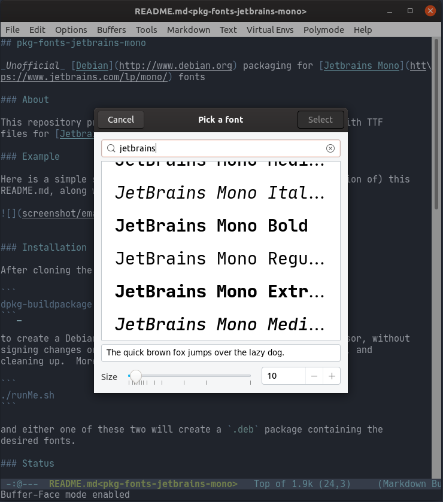

## pkg-fonts-jetbrains-mono

_Unofficial_ [Debian](http://www.debian.org) packaging for [Jetbrains Mono](https://www.jetbrains.com/lp/mono/) fonts

### About

This repository provides a simple way to create a .deb package with TTF 
files for [Jetbrains Mono](https://www.jetbrains.com/lp/mono/)

### Example

Here is a simple screenshot showing Emacs 26 on (an earlier version of) this
README.md, along with the font selector.




### Installation

After cloning the repository run

```
dpkg-buildpackage -rfakeroot -us -uc -tc
```

to create a Debian binary using the common _fakeroot_ suid accessor, without
signing changes or control file as we are not uploading anywhere, and
cleaning up.  More easily, just run

```
./runMe.sh
```

and either one of these two will create a `.deb` package containing the
desired fonts.

### Status

This is a somewhat ad-hoc package for personal use which I am not even
putting onto my [PPA](https://launchpad.net/~edd/+archive/ubuntu/misc).
It takes a shortcut in packaging / building as the actual fonts are
downloaded rather than made from their sources. That is not exactly how
Debian does things; some discussion (for a different font) is at
[this bug report](https://bugs.debian.org/cgi-bin/bugreport.cgi?bug=736681).

### See Also

My similar repositories for creating packages for
[Fira](https://github.com/eddelbuettel/pkg-fonts-fira),
[Source Code Pro](https://github.com/eddelbuettel/pkg-fonts-source-code-pro),
IBM [Plex](https://github.com/eddelbuettel/pkg-fonts-plex) and a few other
package matching `pkg-fonts-*` in [my github repo](https://github.com/eddelbuettel/).

### Author

Dirk Eddelbuettel

### License

The packaging is provided under the GPL (version 2 or later).  The underlying
fonts (which are _not included in this repository_) are licensed under the
[Apache 2.0 License](https://www.apache.org/licenses/LICENSE-2.0).
